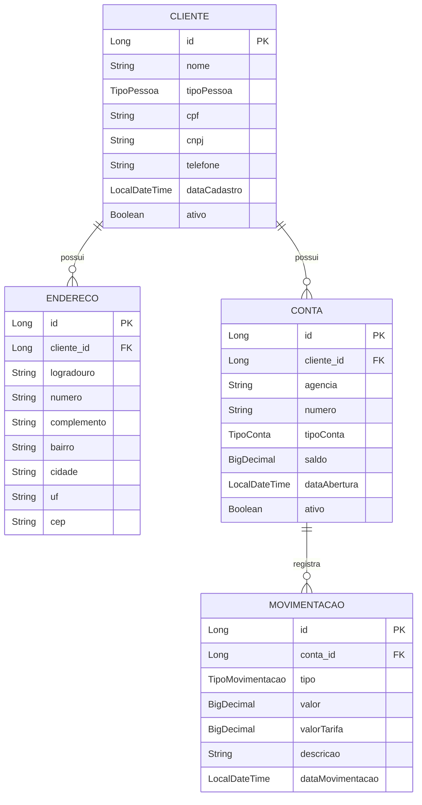
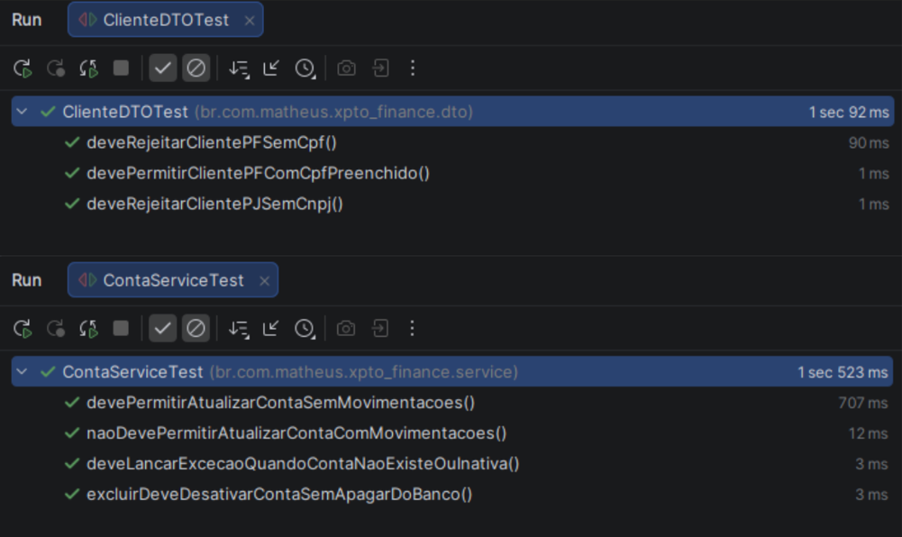
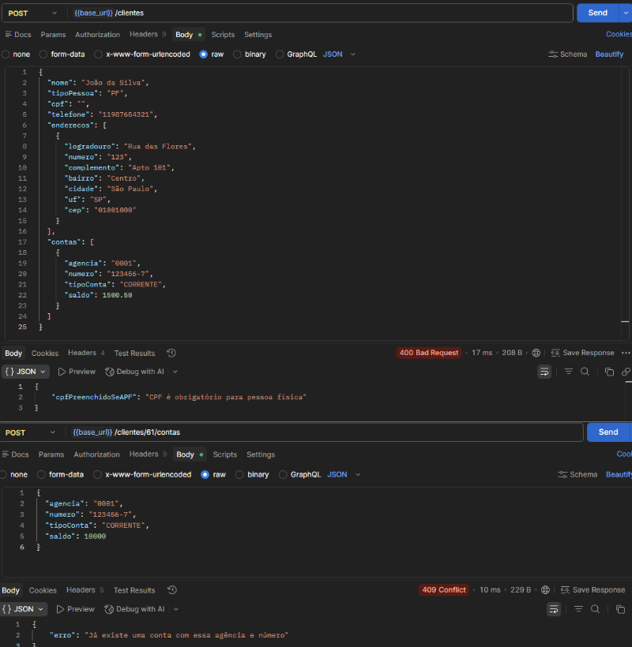
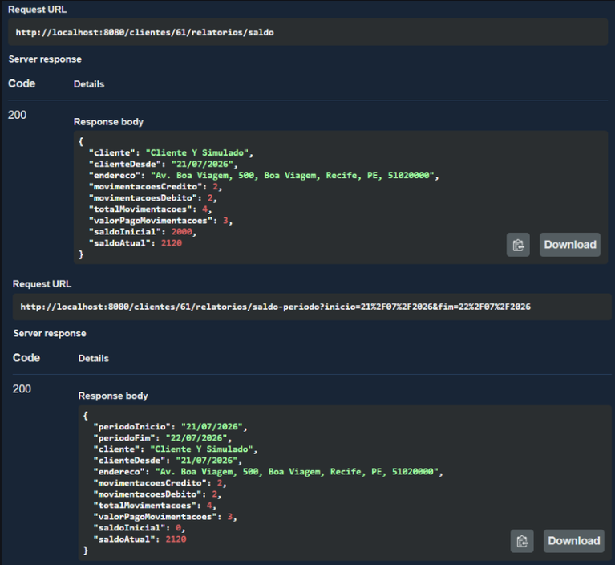
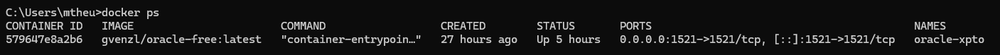
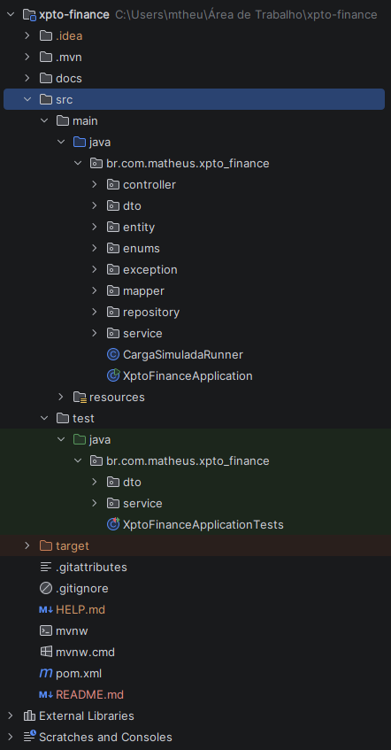

# XPTO Finance

Sistema de controle de receitas e despesas para clientes Pessoa Física e Pessoa Jurídica, desenvolvido como desafio
técnico (Java + Oracle).

A empresa fictícia **XPTO** presta serviço de controle financeiro para diversos clientes (Pessoa Física ou Jurídica),
cobrando uma tarifa progressiva sobre cada movimentação bancária processada.


---

## Sumário

- [Sobre o projeto](#sobre-o-projeto)
- [Arquitetura em camadas](#arquitetura-em-camadas)
- [Modelagem de dados](#modelagem-de-dados)
- [Regras de negócio](#regras-de-negócio)
- [Objeto PL/SQL obrigatório](#objeto-plsql-obrigatório)
- [Tecnologias utilizadas](#tecnologias-utilizadas)
- [Configuração e segurança](#configuração-e-segurança)
- [Como executar o projeto](#como-executar-o-projeto)
- [Endpoints da API](#endpoints-da-api)
- [Testes automatizados](#testes-automatizados)
- [Padrões de projeto e boas práticas](#padrões-de-projeto-e-boas-práticas)
- [Decisões técnicas](#decisões-técnicas)
- [Capturas de tela](#capturas-de-tela)

---

## Sobre o projeto

A XPTO controla o histórico financeiro de vários clientes (PF ou PJ), cada um podendo ter uma ou mais contas bancárias.
Toda movimentação bancária (crédito ou débito) processada nessas contas gera uma tarifa para a XPTO, calculada
progressivamente conforme o volume de movimentações do cliente em uma janela de 30 dias.

O sistema expõe uma API REST completa para:

- Cadastro e manutenção de clientes, endereços e contas (CRUD)
- Registro de movimentações financeiras, com cálculo automático de tarifa via banco de dados
- Geração de relatórios de saldo (posição atual e por período)

---

## Arquitetura em camadas

O projeto segue arquitetura em camadas (*layered architecture*), com responsabilidades bem separadas:

```
Controller  →  Service  →  Repository  →  Banco de Dados (Oracle)
    ↓             ↓
   DTO         Mapper  →  Entity
```

- **Controller**: recebe a requisição HTTP, valida o payload (`@Valid`) e delega para o Service. Nunca contém regra de
  negócio.
- **Service**: concentra a regra de negócio (validações condicionais, orquestração de múltiplas entidades, chamadas à
  function PL/SQL). É o único ponto que fala diretamente com o Repository.
- **Repository**: interfaces `JpaRepository` do Spring Data JPA — sem implementação manual, exceto pelas *query methods*
  derivadas por nome (ex. `findAllByClienteId`).
- **Mapper**: classes `@Component` dedicadas a converter Entity ↔ DTO. Optamos por mappers escritos à mão em vez de uma
  biblioteca (MapStruct/AutoMapper), dado o tamanho do desafio — o ganho de produtividade de uma lib não compensaria a
  curva de configuração extra para o escopo do projeto.
- **DTO de entrada vs. saída**: todo recurso principal tem um DTO de request (ex. `ClienteDTO`, usado em POST/PUT) e um
  DTO de response (`ClienteResponseDTO`) — a Entity JPA **nunca** é serializada diretamente na resposta HTTP, evitando
  expor detalhes de persistência (proxies do Hibernate, relacionamentos bidirecionais) e problemas de serialização em
  cascata.

---

## Modelagem de dados



### Modelagem de Cliente PF/PJ

Como clientes do tipo pessoa física e pessoa jurídica possuem documentos diferentes, foi adotada uma **tabela única**
para representar os dois tipos de cliente.

A diferenciação é realizada pelo enum `TipoPessoa`, que pode assumir os valores `PF` ou `PJ`, enquanto CPF e CNPJ são
armazenados em campos separados na entidade `Cliente`.

Para preservar a consistência dos dados, o `ClienteDTO` possui uma validação com `@AssertTrue`. Essa validação garante,
no momento da requisição, que:

* clientes do tipo `PF` tenham o CPF preenchido e não possuam CNPJ;
* clientes do tipo `PJ` tenham o CNPJ preenchido e não possuam CPF.

Essa validação é importante porque, em uma tabela única, o banco permite que os campos de CPF e CNPJ sejam nulos. Sem
essa regra, seria possível cadastrar combinações inválidas, como uma pessoa física com CNPJ ou uma pessoa jurídica sem
CNPJ.

Na resposta da API, para evitar a exposição de dois campos em que um deles estaria sempre vazio, o `ClienteResponseDTO`
possui apenas o campo `documento`.

Durante a conversão da entidade para o DTO, o `ClienteMapper` verifica o tipo da pessoa e seleciona o documento
correspondente:

```java
String documento = cliente.getTipoPessoa() == TipoPessoa.PF
        ? cliente.getCpf()
        : cliente.getCnpj();
```

Em seguida, o valor selecionado é atribuído ao campo `documento`:

```java
return ClienteResponseDTO.builder()
        .

id(cliente.getId())
        .

nome(cliente.getNome())
        .

tipoPessoa(cliente.getTipoPessoa())
        .

documento(documento)
        .

telefone(cliente.getTelefone())
        .

dataCadastro(cliente.getDataCadastro())
        .

ativo(cliente.getAtivo())
        .

build();
```

Dessa forma, a tabela única mantém uma estrutura mais simples, enquanto a validação no DTO evita inconsistências durante
o cadastro e o mapper padroniza a resposta da API.


---

## Regras de negócio

- **Movimentação inicial obrigatória**: toda conta nasce com uma movimentação de crédito (`"Movimentação inicial"`),
  representando o saldo de abertura. Isso é criado automaticamente no cadastro do cliente ou da conta — nunca precisa
  ser feito manualmente.
- **Tarifação progressiva** (calculada via PL/SQL, ver seção abaixo):
    - Até 10 movimentações no período de 30 dias: R$ 1,00 por movimentação
    - De 10 a 20 movimentações: R$ 0,75 por movimentação
    - Acima de 20 movimentações: R$ 0,50 por movimentação
- **Imutabilidade de dados históricos**: CPF, CNPJ e tipo de pessoa não podem ser alterados após o cadastro (garante
  integridade do histórico financeiro).
- **Exclusão lógica (soft delete)** em Cliente e Conta: `DELETE` nunca remove a linha do banco, apenas marca
  `ativo = false`. Isso preserva o histórico de movimentações e evita quebra de integridade referencial.
- **Bloqueio de alteração de conta com movimentações**: uma conta que já processou qualquer movimentação não pode mais
  ser editada (`agência`/`número`/`tipo`) — apenas desativada.
- **Saldo pode ficar negativo**: não há trava impedindo débito maior que o saldo disponível. Decisão consciente,
  simulando algo como limite de cheque especial, já que o enunciado não veda esse cenário.

---

## Objeto PL/SQL obrigatório

O desafio exige pelo menos um objeto PL/SQL chamado a partir do Java. Foi criada a function
`calcular_tarifa_movimentacao`, responsável por calcular o valor da tarifa de uma movimentação com base no histórico do
cliente.

```sql
CREATE
OR REPLACE FUNCTION calcular_tarifa_movimentacao (
    p_cliente_id         IN NUMBER,
    p_data_movimentacao  IN DATE
) RETURN NUMBER
IS
    v_data_cadastro       DATE;
    v_dias_desde_cadastro
NUMBER;
    v_inicio_periodo
DATE;
    v_fim_periodo
DATE;
    v_qtd_movimentacoes
NUMBER;
    v_tarifa
NUMBER(15,2);
BEGIN
    -- 1. busca a data de cadastro do cliente, marco zero dos períodos de 30 dias
SELECT DATA_CADASTRO
INTO v_data_cadastro
FROM CLIENTE
WHERE ID = p_cliente_id;

-- 2. descobre em qual janela de 30 dias a movimentação atual cai
v_dias_desde_cadastro
:= TRUNC(p_data_movimentacao) - TRUNC(v_data_cadastro);
    v_inicio_periodo
:= TRUNC(v_data_cadastro) + FLOOR(v_dias_desde_cadastro / 30) * 30;
    v_fim_periodo
:= v_inicio_periodo + 30;

    -- 3. conta as movimentações do cliente (todas as contas) dentro dessa janela
SELECT COUNT(*)
INTO v_qtd_movimentacoes
FROM MOVIMENTACAO M
         INNER JOIN CONTA C ON C.ID = M.CONTA_ID
WHERE C.CLIENTE_ID = p_cliente_id
  AND M.DATA_MOVIMENTACAO >= v_inicio_periodo
  AND M.DATA_MOVIMENTACAO < v_fim_periodo;

-- +1: a movimentação atual ainda não foi persistida no momento do cálculo
v_qtd_movimentacoes
:= v_qtd_movimentacoes + 1;

    -- 4. aplica a faixa de tarifa
    IF
v_qtd_movimentacoes <= 10 THEN
        v_tarifa := 1.00;
    ELSIF
v_qtd_movimentacoes <= 20 THEN
        v_tarifa := 0.75;
ELSE
        v_tarifa := 0.50;
END IF;

RETURN v_tarifa;
END;
/
```

**Por que a function recebe `cliente_id` + `data`, e não `id_movimentacao`?** No momento em que a tarifa precisa ser
calculada, a movimentação ainda não foi persistida — ela só é gravada depois, já com o valor da tarifa preenchido.
Calcular a partir de dados que já existem (histórico do cliente + a data do evento atual) evita um fluxo de "salvar sem
tarifa → recalcular → atualizar", que exigiria duas idas ao banco e deixaria uma janela de inconsistência.

A chamada é feita a partir do Java via `JdbcTemplate`, dentro de `TarifaService`, e o valor retornado é gravado no campo
`valorTarifa` da entidade `Movimentacao`.

---

## Tecnologias utilizadas

| Categoria           | Tecnologia                                  |
|---------------------|---------------------------------------------|
| Linguagem           | Java 21                                     |
| Framework           | Spring Boot 4.1                             |
| Web                 | Spring Web (REST API)                       |
| Persistência        | Spring Data JPA (Hibernate)                 |
| Banco de dados      | Oracle Database (rodando via imagem Docker) |
| Driver JDBC         | Oracle JDBC Driver (ojdbc)                  |
| Validação           | Bean Validation (Jakarta Validation)        |
| Boilerplate         | Lombok                                      |
| Build               | Maven                                       |
| Testes              | JUnit 5, Mockito, AssertJ                   |
| Cliente de banco    | DBeaver 26.1.3                              |
| Documentação da API | Springdoc OpenAPI / Swagger UI              |

---

## Configuração e segurança

As credenciais de acesso ao Oracle são fornecidas por variáveis de ambiente, evitando que valores sensíveis sejam
armazenados diretamente no repositório. Esses valores são lidos pelo `application.properties`:

```properties
spring.datasource.url=${DB_URL}
spring.datasource.username=${DB_USER}
spring.datasource.password=${DB_PASSWORD}
spring.datasource.driver-class-name=oracle.jdbc.OracleDriver
```

Antes de rodar a aplicação, defina essas variáveis no seu ambiente:

```bash
export DB_URL=jdbc:oracle:thin:@localhost:1521/FREEPDB1
export DB_USER=system
export DB_PASSWORD=sua_senha_aqui
```

---

## Como executar o projeto

### Pré-requisitos

- JDK 21
- Maven
- Docker (para subir o Oracle localmente)

### 1. Subir o banco Oracle via Docker

```bash
docker run -d --name oracle-xpto \
  -p 1521:1521 \
  -e ORACLE_PASSWORD=sua_senha_aqui \
  gvenzl/oracle-free
```

### 2. Executar o script PL/SQL

Conecte no banco via DBeaver (ou outro cliente SQL) e rode o script da function `calcular_tarifa_movimentacao`
(disponível em `/src/main/resources/sql/`).

### 3. Definir as variáveis de ambiente

Conforme a seção [Configuração e segurança](#configuração-e-segurança).

### 4. Rodar a aplicação

Após configurar o banco de dados e as variáveis necessárias, basta abrir o projeto na IDE e executar a classe principal
da aplicação, clicando em Run.

### 5. Acessar a documentação interativa

```
http://localhost:8080/swagger-ui/index.html
```

---

## Endpoints da API

### Clientes

| Método | Rota             | Descrição                                            |
|--------|------------------|------------------------------------------------------|
| POST   | `/clientes`      | Cria cliente (com endereço e conta iniciais)         |
| GET    | `/clientes`      | Lista clientes ativos                                |
| GET    | `/clientes/{id}` | Busca cliente por ID                                 |
| PUT    | `/clientes/{id}` | Atualiza nome/telefone (CPF/CNPJ/tipo são imutáveis) |
| DELETE | `/clientes/{id}` | Exclusão lógica                                      |

### Contas

| Método | Rota                                | Descrição                                         |
|--------|-------------------------------------|---------------------------------------------------|
| POST   | `/clientes/{clienteId}/contas`      | Cria conta (com movimentação inicial)             |
| GET    | `/clientes/{clienteId}/contas`      | Lista contas do cliente                           |
| GET    | `/clientes/{clienteId}/contas/{id}` | Busca conta por ID                                |
| PUT    | `/clientes/{clienteId}/contas/{id}` | Atualiza conta (bloqueado se houver movimentação) |
| DELETE | `/clientes/{clienteId}/contas/{id}` | Exclusão lógica                                   |

### Endereços

| Método | Rota                                   | Descrição                    |
|--------|----------------------------------------|------------------------------|
| POST   | `/clientes/{clienteId}/enderecos`      | Adiciona endereço ao cliente |
| GET    | `/clientes/{clienteId}/enderecos`      | Lista endereços do cliente   |
| GET    | `/clientes/{clienteId}/enderecos/{id}` | Busca endereço por ID        |
| PUT    | `/clientes/{clienteId}/enderecos/{id}` | Atualiza endereço            |
| DELETE | `/clientes/{clienteId}/enderecos/{id}` | Remove endereço              |

### Movimentações

| Método | Rota                              | Descrição                                            |
|--------|-----------------------------------|------------------------------------------------------|
| POST   | `/contas/{contaId}/movimentacoes` | Registra movimentação (tarifa calculada via PL/SQL)  |
| GET    | `/contas/{contaId}/movimentacoes` | Lista movimentações da conta (mais recente primeiro) |

### Relatórios

| Método | Rota                                             | Descrição                                  |
|--------|--------------------------------------------------|--------------------------------------------|
| GET    | `/clientes/{clienteId}/relatorios/saldo`         | Saldo consolidado atual do cliente         |
| GET    | `/clientes/{clienteId}/relatorios/saldo-periodo` | Saldo consolidado em um período específico |

---

## Testes automatizados

| Classe             | O que cobre                                                                                                                                  |
|--------------------|----------------------------------------------------------------------------------------------------------------------------------------------|
| `ContaServiceTest` | Regra de bloqueio de alteração de conta com movimentações associadas; exclusão lógica (soft delete); tratamento de conta inexistente/inativa |
| `ClienteDTOTest`   | Validação condicional de CPF/CNPJ conforme o tipo de pessoa (PF exige CPF, PJ exige CNPJ)                                                    |

---

## Padrões de projeto e boas práticas

- **Tratamento de exceções centralizado** via `@RestControllerAdvice` (`GlobalExceptionHandler`), cobrindo validação de
  campos, recurso não encontrado, enum inválido, conflito de regra de negócio e erro genérico — sempre devolvendo um
  corpo JSON consistente
- **Soft delete** para preservação de histórico financeiro (Cliente e Conta)
- **DRY (Don't Repeat Yourself)**: lógica repetida entre os relatórios (busca de cliente ativo, filtro de contas ativas,
  formatação de endereço) foi extraída para métodos privados reaproveitados no `RelatorioService`

---

## Decisões técnicas

- **Tabela única para clientes PF e PJ**: a diferenciação é realizada pelo enum `TipoPessoa`, enquanto CPF e CNPJ são
  armazenados em campos separados. Uma validação condicional no DTO garante que o documento correspondente ao tipo de
  pessoa seja informado corretamente.
- **Mapeamento manual entre entidades e DTOs**: os mappers foram implementados manualmente, sem o uso de bibliotecas
  como MapStruct ou ModelMapper, pois a quantidade de conversões do projeto não justificava uma dependência adicional.
- **Saldo consolidado por cliente**: como um cliente pode possuir várias contas, seu saldo total corresponde à soma dos
  saldos de todas as contas ativas.
- **Endereço utilizado nos relatórios**: como os relatórios possuem apenas um campo de endereço, é utilizado o primeiro
  endereço cadastrado para o cliente.
- **Registro do saldo inicial**: o saldo informado na abertura da conta é registrado como uma movimentação de crédito,
  preservando a rastreabilidade do valor nas consultas e nos relatórios.
- **Possibilidade de saldo negativo**: não foi implementado limite de cheque especial ou bloqueio de movimentações por
  saldo insuficiente, pois essa regra não foi definida no enunciado.

---

## Capturas de tela

### Testes automatizados

Os testes validam as regras de documento do cliente e as operações relacionadas às contas.



### Tratamento de erros

A API retorna mensagens padronizadas para erros de validação e conflitos de regra de negócio.



### Relatórios financeiros

Exemplo de resposta dos relatórios de saldo geral e saldo por período.



### Banco de dados com Docker

Container do Oracle Database em execução.



### Organização do projeto

Estrutura de pacotes adotada na aplicação.

